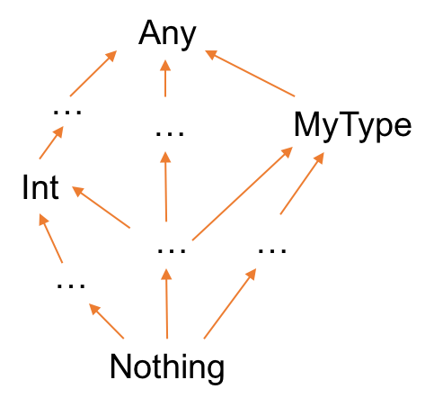
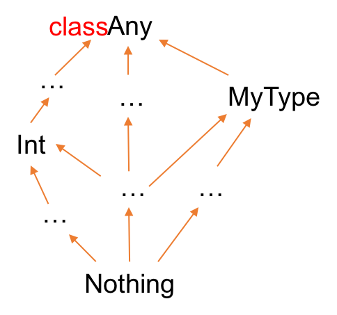

### Swift と Kotlin 異文化旅行
2017/7/8   
\#yidev  
ezura

---

### \\(self)
* ezura
* iOS engineer @ LINE
* <aside>iosdc 応募ネタの一つのその一部？個人的におもしろくてすぐさま誰かに話したかった</aside>

---

Kotlin

+++

Android で公式にサポート  
ちょっと気になる存在…

+++

Swift と Kotlin

+++

似てるの？？

+++

確かに、構文が似てる部分もある
<aside>初めてコードを見たときも親しみやすかった印象</aside>

+++

* 静的型付け
* 型推論
* Null safe
* interface が default implement を持てる
* Object 指向
* 関数プログラミング
* Generics
* ...

+++

似てそう？？  
でも…

+++

~~一歩進むたびに~~  
もはや足をあげるところから  
違いに出会う世界 😇  
(文化的な観点で)

+++

今回は、その体験を味わいながら  
進められたら良いなと思います 😊

---

### index
* Kotlin はどんな言語？
* 標準ライブラリ 有名観光地ツアー
  * Type hierarchy
  * Root type: class Any
  * Variance
  * Singleton

---

### Kotlin
* 静的型付け
* null safe
* Java と 100% 互換
* オブジェクト指向
* 関数プログラミング

+++

### Kotlin
* 静的型付け
* null safe
* Java と 100% 互換
* **オブジェクト指向**
* 関数プログラミング

+++

Swift よりもオブジェクト指向寄りな設計が  
ところどころで見えるような…？  
(注: 私見)

+++

### 演算子
##### Swift
```swift:Swift
func +(r: Type, l: Type) -> Type { ... }
```

##### Kotlin
```kotlin:Kotlin
class Type {
    operator fun plus(v: Type): Type { ... }
}
```

+++

### 型変換
##### Swift
```swift:Swift
class Destination {
    init(_ value: Source) { ... }
}

let v = Destination(source)
```

##### Kotlin
```kotlin:Kotlin
class Source {
    fun toDestination: Destination { ... }
}

val v = source.toDestination()
```
<aside>余談: Kotlin は extension で constructor を作れない)</aside>

+++

#### 超余談
```kotlin
// Kotlin
fun Destination(v: Source): Destination {
    ...
}

let v = Destination(source)
```
<aside>こういう方法もあるらしい…</aside>

---

### 標準ライブラリ 有名観光地ツアー

+++

### List
<aside>Kotlin にも Array はあるけれど  
機能的には List の方が Swift の Array に近い部分が多い。</aside>
<aside>List の方がポピュラー</aside>

+++

```kotlin
val list = listOf(1, 2, 3)
```

+++

```kotlin
val list: List<Int> = listOf(1, 2, 3)
```
@[1](`listOf` を見てみよう)

+++?code=assets/codes/listOf.kt
<aside>注: スライド上での見やすさのため、整形しています</aside>

---

```kotlin
/** Returns a new read-only list of given elements. */
fun <T> listOf(vararg elements: T): List<T> {
    if (elements.size > 0) {
        elements.asList() 
    } else {
        emptyList()
    }
}
```
@[1]("read-only list"。変更したいときは？？)

+++

```kotlin
// Kotlin
/**
 * A generic ordered collection of elements that supports adding and removing elements.
 * @param E the type of elements contained in the list. The mutable list is invariant on its element type.
 */
public interface MutableList<E> : List<E>, MutableCollection<E> {
    // Modification Operations
    override fun add(element: E): Boolean

    override fun remove(element: E): Boolean
```
@[6]
`List<E>` を継承した変更可能な `List`
<aside>Objective-C と同様な構造 (ただし objc の場合、要素は何でも入る)</aside>

+++

```swift
// Swift
// mutable array
var array = [1, 2]
array[0] = 0

// immutable array
let array = [1, 2]
// array[0] = 0 // ❗️error
```
<aside>Swift の Array は Value type</aside>
<aside>Mutable、Immutable は型と切り離された部分で制御される</aside>

+++

```kotlin
// Kotlin
val mutableList: MutableList<Int> = mutableListOf(1, 2)
val list: List<Int> = mutableList  // [1, 2]

mutableList.add(3)
print(list)  // [1, 2, 3]
```
@[6](immutable 性が壊れる\(だから "read-only" と書かれていて、"immutable" とは書かれてないのかな…\))
有名な問題点

+++

Swift では Array を Value type で実装することで回避できている…？  
Value type の恩恵、すごい…！

+++

Kotlin の Any は
* 全ての型の super type (Swift と同じ)
* **class** ← ‼️

+++

### 余談
[Project Valhalla](http://openjdk.java.net/projects/valhalla/) によって Value type がサポートされる？

---?code=assets/codes/listOf.kt
@[2](`List<E>`)

+++?code=assets/codes/list.kt
@[6](`out`...?)

+++

### Variance annotation

+++

### Variance
* invariant
* covariant (out) 
* contravariant (in)

+++

### invariant

`Any` <- `Int`  
のとき  
`MyBox<Any>` -❌- `MyBox<Int>`

<aside>Swift は基本的にはこれ (Array, Optional 等、一部の型以外)</aside>
<aside>ただし、`intout` 指定のときは `Array` も invariant になる</aside>
<aside>(Kotlin の　Array は要素に対して不変)</aside>

+++

### covariant の例

`Any` ← `Int`  
のとき  
`Array<Any>` ← `Array<Int>`
<aside>Swift の Array</aside>

+++

### contravariant の例

`Any` ← `Int`  
のとき  
`(Int) -> T` ← `(Any) -> T`

+++

### out, in

```swift
let outF: () -> Any = { () -> Int in return 1 }

let inF: (Int) -> Void = { (v: Any) -> Void in print(v) }
```
@[1](型の持つ性質を包含する型なら代替できる)
@[3](型の持つ性質を超えない型なら代替できる)

+++

* Swift だと、提供されている型(function type 含む)のみ適応
* Kotlin だと自分で指定できる！

+++

### ちょっと余談
Swift でも、Variance 指定、垣間見える場合がある
```swift
func f(_ v: Array<Any>) {}
func inoutF(_ v: inout Array<Any>) {}

var v: Array<Int> = [1, 2, 3]
f(v)  // OK
// error: cannot convert value of type 'Array<Int>' to expected argument type 'inout Array<Any>'
inoutF(v)  // error
```
@[2](inout)

+++?code=assets/codes/list.kt
要素に対して `out` 指定することによって  
`List<E>` ← `List<E の subtype>`  
の関係が生まれる

+++
```swift
// Swift
let array: Array<Any> = [] as Array<Int>

let myType: MyType<Any> = MyType<Int>() // !!: error
```
Swift での Array のように要素の型を柔軟に扱える

+++

```kotlin
class A<in T> { ... }

fun f(v: B<in T>): T { ... }

var v: C<out T> = ...
```

自分で Variance を指定できるのは表現の幅が広がる！

---?code=assets/codes/list.kt
さかのぼって

+++?code=assets/codes/listOf.kt
@[6](`emptyList`...?)

+++

```kotlin
/** Returns an empty read-only list.  The returned list is serializable (JVM). */
public fun <T> emptyList(): List<T> = EmptyList
```

+++

```kotlin
object EmptyList : List<Nothing>, Serializable, RandomAccess {
// 略
}
```
@[1](`object`...?)

+++

### `Object`
* Singleton
* constractor が指定できない以外、class と同様の機能を持てる

+++

```kotlin
object EmptyList : List<Nothing>, Serializable, RandomAccess {
// 略
}
```
@[1](`List<Nothing>`)

+++

#### Type hierarchy



+++

#### Type hierarchy



+++

* Any: 全ての型の super type
* Nothing: 全ての型の sub type (instance は作れない)

+++

### Any
* Kotlin: class
* Swift: 予約語。実態は空の protocol (-> Non-nominal type)

+++

### Notthing
* Kotlin: 全ての型の sub type
* Swift: ない (挙動として近しいのは `Never`)

+++

```swift
// Swift
var v: Int { fatalError() /* -> Never */ }

func f() -> Any { fatalError() /* -> Never */ }

// ただし、これはできない (Never は Int の sub type でない)
let i: Int = Int(exactly: 1) ?? fatalError()
```

+++

```kotlin
// Kotlin
val i: Int = "1".toIntOrNull() ?: TODO() /* Never */
```
@[1-2](ということは…)

+++?code=assets/codes/list.kt
@[6](`List<out E>`, `Nothing`)

+++

```kotlin
val numbers: List<Int> = EmptyList /* List<Nothing> */

val anys: List<Any?> = EmptyList /* List<Nothing> */
```

+++?code=assets/codes/listOf.kt
E がどんな type に対しても `emptyList`は sub type になれる  
そして、`EmptyList` は singleton...  
か、完璧だ...！

---

### まとめ

+++

* 構文は Swift と似ている部分も多い
* Swift とは違う文明が築き上げられている (今回は氷山の一角)
  * Type hierarchy
  * Variance
  * Singleton サポート
  * Delegation
  * Annotation
  * ...
* Swift の素晴らしさも Kotlin の素晴らしさも、それぞれあった

### とても参考になった資料 (順不同)
* [Kotlin Reference](https://kotlinlang.org/docs/reference/)
* [Kotlinスタートブック](http://www.ric.co.jp/book/contents/book_1039.html)
* [JavaプログラマのためのKotlin入門](http://qiita.com/koher/items/bcc58c01c6ff2ece658f)
* [Android開発を受注したからKotlinをガッツリ使ってみたら最高だった](http://qiita.com/omochimetaru/items/98e015b0b694dd97f323)
